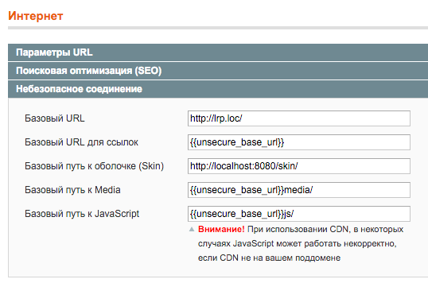

[Webpack Dev Server](https://webpack.github.io/docs/webpack-dev-server.html) позволяет очень быстро собирать и отдавать статические ресурсы в процессе разработки. Для комфортной работы важно, чтобы изменения были видны моментально. В заметке рассматривается настройка Magento и WDS для совместной работы: Magento отдает данные и HTML, WDS занимается CSS, JS, картинками, шрифтами и прочими модулями из сборки.
<span class="more"></span>

# Конфиг
Файл `webpack.config.js` лучше поместить в корне проекта. Так на всех проектах к нему будет один путь. Если конфиг будет в папке с темой, то к нему надо еще добраться.

`package.json` так же лучше поместить в корень проекта. Таким образом папка `node_modules` будет одна на весь проект. К тому же в разделе `scripts` удобно хранить команды запуска сборки (об этом ниже).

# Зависимости модулей
В каждом модуле подключаются все его зависимости. Напирмер, jQuery и любые другие библиотеки и плагины. Так модуль можно будет перенести, переписать на ES6 и т. д. Общие зависимости можно вынести через [`CommonsChunkPlugin`](https://webpack.github.io/docs/list-of-plugins.html#commonschunkplugin).

# Точки входа
Точки входа логично делать в соответствии с разделами сайта. Каждому JS-модулю будет соответствовать CSS-файл:

```js
    entry: {
        common: './src/common', // Нужен на всех страницах
        home: './src/home' // Подключается только для главной
        //account
        //category
        //product
        //cms
        //checkout
        //cart
        //stores
        //certificates
        //diagnostic
        //faq
        //news + blog + video
    },
```

# Настройка WDS и Magento
WDS по умолчанию запустится на хосте `http://localhost:8080`. Проект на Мадженто будет работать по другому адресу, типа, `http://my-project.local`.

Чтобы Мадженто запрашивала статические ресурсы с WDS достаточно в админке прописать нужный «Базовый путь к оболочке (Skin)» в разделе Система/Конфигурация/Общие - Интернет:



Таким образом мы имеем 2 разных домена с перекрестными запросами. Мадженто запрашивает стили с WDS, WDS отдает CSS, а вместе с ним шрифты, картинки и пр., а это уже [Cross-Origin Resource Sharing](https://en.wikipedia.org/wiki/Cross-origin_resource_sharing) и браузер будет блокировать подгрузку ресурсов.

Чтобы сказать браузеру, что все ок, нужно добавить вот такую настройку в WDS (ниже будет пример конфига целиком):

```js
headers: {
    // Handling issue with CORS font loading
    "Access-Control-Allow-Origin": "*"
}
```


Нужно так же указать `publicPath` для `dev` и `prod` сборки. Его можно отдавать с помощью функции в зависимости от переменной окружения (см. `getPublicPath` ниже).

Следует обратить внимание на сборку ресурсов для продакшена. На продакшене нам нужны оптимизированные, отдельные файлы CSS. Для разработки, наоборот, важна прежде всего скорость, поэтому оптимизация и вынесение стилей ни к чему.

Для вынесения CSS в отдельные файлы можно использовать [`ExtractTextPlugin`](https://github.com/webpack/extract-text-webpack-plugin). Каждой точке сборки будет соответствовать свой CSS-файл.

Пример конфига для работы с WDS и Magento:

```js
var NODE_ENV = process.env.NODE_ENV || 'development',
    path = require('path'),
    webpack = require('webpack'),
    Clean = require('clean-webpack-plugin'),
    ExtractTextPlugin = require('extract-text-webpack-plugin'),
    WebpackNotifierPlugin = require('webpack-notifier');

function getPublicPath() {
    return NODE_ENV == 'development'

        // Absolute url for development
        ? 'http://localhost:8080/skin/frontend/laroche/oggetto/public/'

        //Relative path for production
        : '/';
}

function getExtractLoaders() {
    return NODE_ENV == 'development'

        // Serve fonts and images from less files as modules in development mode.
        ? 'css!autoprefixer?{browsers:["last 2 version", "IE 9"]}!less'

        // Do nothing while building production version.
        : 'raw!autoprefixer?{browsers:["last 2 version", "IE 9"]}!less';
}

module.exports = {
    context: path.resolve('skin/frontend/laroche/oggetto'),

    entry: {
        app: './src/app'
        //home: './src/home'
    },

    output: {
        path: path.resolve('skin/frontend/laroche/oggetto/public'),
        publicPath: getPublicPath(),
        filename: 'js/[name].js'
    },

    externals: {
        "jquery": "jQuery"
    },

    module: {
        loaders: [
            {
                test: /\.less$/,
                loader: ExtractTextPlugin.extract("style", getExtractLoaders())
            },
            {
                test: /\.css$/,
                loader: 'style!css'
            },

            // Webpack handles fonts and images only in development mode (see .less settings above)
            {
                test: /\.(svg|eot|ttf|woff)/,
                loader: 'file?name=[path][name].[ext]'
            },
            {
                test: /\.(?:png|jpg|gif)$/,
                loader: 'file?name=[path][name].[ext]'
            }
        ]
    },

    devServer: {
        headers: {
            // Handling issue with CORS font loading
            "Access-Control-Allow-Origin": "*"
        }
    },

    plugins: [
        new Clean(['public']),

        new ExtractTextPlugin('css/all.css', { // [name].css after code splitting
            allChunks: true,
            disable: NODE_ENV == 'development' // Save separate files only for production build
        }),

        new webpack.NoErrorsPlugin(),

        new WebpackNotifierPlugin()
    ]
};
```

# Скрипты сборки
В `package.json` удобно хранить команды запуска сборки. Можно сделать как-то так:

```js
"scripts": {
    "start": "webpack-dev-server --hot --inline --devtool eval --progress --colors",
    "dev": "env NODE_ENV=development npm start",
    "prod": "env NODE_ENV=production webpack -p",
    "build": "env NODE_ENV=production webpack -d"
}
```

`npm start` — запуск Webpack Development Server с настройками для удобной разработки. Эта команда будет использована далее в скрипте `dev`.

`npm run dev` — основная команда запуска окружения для локальной разработки. Нужно указать в админке путь к папке skin как `http://localhost:8080/skin`, иначе файлы будут браться с файловой системы (см. выше). При dev-сборке (`NODE_ENV=development`) стили пропускаются через `css-loader` и картинки со шрифтами обрабатываются Вебпаком. Их не видно на файловой системе, они хранятся в ОЗУ.

`npm run prod` — собрать проект для продакшена. Будут сгенерированы css и js-файлы. Вебпак не обрабатывает картинки и шрифты, они останутся лежать где и лежали. Вместо `css-loader` используется `raw-loader`.


`npm run build` — быстрая сборка с сорс-мапами. Аналогична сборке для продакшена, но никакие ресурсы не оптимизируются. Удобно, когда нужно что-то посмотреть на файловой системе и отладить. Это простая статическая сборка без оптимизации.


# Быстрая смена skin url
Нужно написать скрипт (на PHP?), который будет менять skin url в Мадженте из командной строки. Так удобней переключаться между дев и прод сборкой, чем каждый раз менять url в админке.

# Подключение скриптов и стилей
Скрипты и стили для разных страниц рекомендуется подключать внизу страницы в соответствующих xml-файлах. Например, `common.css` подключаем в `page.xml`, `home.css` подключаем в `cms.xml` и т. д.

Чтобы это заработало нужно в `page.xml` добавить блок `foot`:

```xml
<block type="page/html" name="root" output="toHtml" template="page/3columns.phtml">
    <!-- This line is for attaching resources into footer: -->
    <block type="page/html_head" name="foot" as="foot" template="page/html/foot.phtml"/>
</block>
```

Далее, подключить его в файлах `1collumn.phtml` и пр.:

```php
<?php echo $this->getChildHtml('foot') ?>
```

Сам файл `foot.phtml` представляет собой урезанный `head.phtml`. В нем остаются только инструкции подключения статических ресурсов:

```xml
<?php echo $this->getCssJsHtml() ?>
<?php echo $this->getChildHtml() ?>
<?php echo $this->getIncludes() ?>
```

Теперь можно подключать нужные файлы стилей и скриптов на отдельных страницах в соответствующих xml-файлах. Например, подключим `home.js` и `home.css` для главной:

```xml
    <cms_index_index translate="label">
        <label>CMS Home Page</label>
        <reference name="foot">
            <action method="addItem">
                <type>skin_js</type>
                <name>public/home.js</name>
            </action>
        </reference>
        <reference name="foot">
            <action method="addItem">
                <type>skin_css</type>
                <name>public/home.css</name>
            </action>
        </reference>
    </cms_index_index>
```

[Источник](http://magento.stackexchange.com/questions/1579/magento-adding-css-and-js-includes-to-the-footer).


